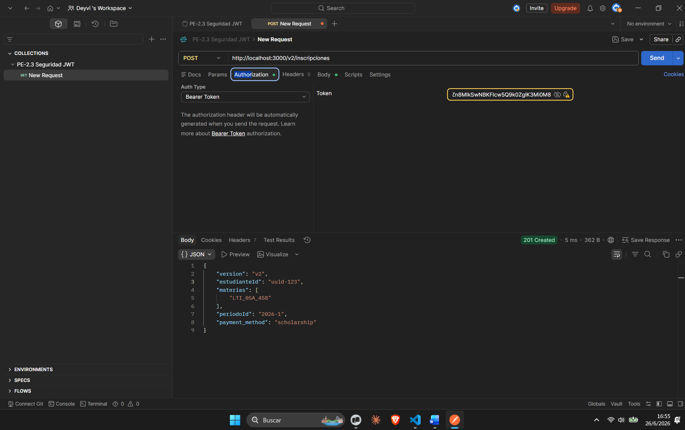
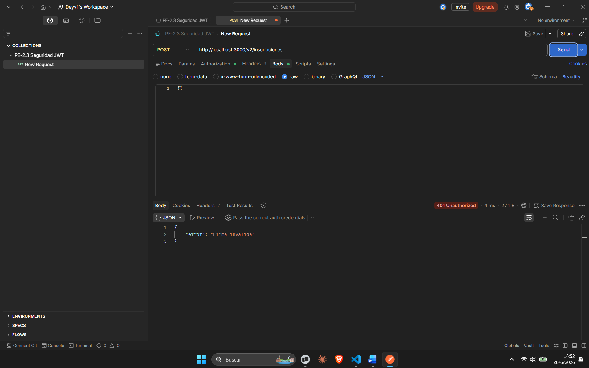
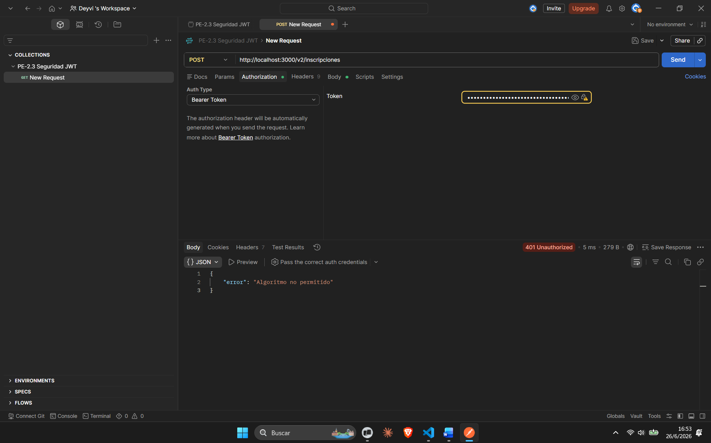

## Resultados de las pruebas de funcionamiento
# (a) Sin API key -> esperado: 401
curl http://localhost:3000/health

PS C:\Users\Deyvii\Documents\api-Deyvi> curl.exe -i http://localhost:3000/health
HTTP/1.1 401 Unauthorized
X-Powered-By: Express
Content-Type: application/json; charset=utf-8
Content-Length: 39
ETag: W/"27-2CykVI0kdPiyYhzLKnAdCW0WYOY"
Date: Thu, 11 Jun 2026 20:56:43 GMT
Connection: keep-alive
Keep-Alive: timeout=5

{"error":"API key inválida o ausente"}
- **Resultado:** Acceso denegado correctamente por el middleware de autenticación (401).


# (b) Con clave válida -> esperado: 200
curl -H "x-api-key: secreto-demo" http://localhost:3000/health
PS C:\Users\Deyvii\Documents\api-Deyvi> curl.exe -i -H "x-api-key: secreto-demo" http://localhost:3000/health
HTTP/1.1 200 OK
X-Powered-By: Express
Content-Type: application/json; charset=utf-8
Content-Length: 47
ETag: W/"2f-EIm53y0fH67jEfJ0pIU3ywvjNTk"
Date: Thu, 11 Jun 2026 20:58:49 GMT
Connection: keep-alive
Keep-Alive: timeout=5

{"status":"ok","ts":"2026-06-11T20:58:49.743Z"}
- **Resultado:** Acceso permitido y respuesta exitosa (200).

# (c) Ruta inexistente -> esperado: 404
curl -H "x-api-key: secreto-demo" http://localhost:3000/noexiste
PS C:\Users\Deyvii\Documents\api-Deyvi> curl.exe -i -H "x-api-key: secreto-demo" http://localhost:3000/noexiste
HTTP/1.1 404 Not Found
X-Powered-By: Express
Content-Security-Policy: default-src 'none'
X-Content-Type-Options: nosniff
Content-Type: text/html; charset=utf-8
Content-Length: 147
Date: Thu, 11 Jun 2026 20:59:11 GMT
Connection: keep-alive
Keep-Alive: timeout=5

<!DOCTYPE html>
<html lang="en">
<head>
<meta charset="utf-8">
<title>Error</title>
</head>
<body>
<pre>Cannot GET /noexiste</pre>
</body>
</html>
- **Resultado:** La API responde correctamente ante rutas no definidas (404).

## Pruebas Unitarias (Testing)
PS C:\Users\Deyvii\Documents\api-Deyvi> npm test       

> api-deyvi@1.0.0 test
> jest

 PASS  src/middlewares/auth.test.ts
 PASS  src/middlewares/logger.test.ts

Test Suites: 2 passed, 2 total
Tests:       5 passed, 5 total
Snapshots:   0 total
Time:        0.65 s, estimated 1 s
Ran all test suites.
PS C:\Users\Deyvii\Documents\api-Deyvi> 

## Documentación del Endpoint

**Endpoint Seleccionado:** Creación de Inscripciones (v2)

* **Método HTTP:** `POST`
* **Ruta:** `/v2/inscripciones`
* **Datos de Entrada (Body JSON):**
    * `estudianteId` (Obligatorio): String. Identificador del estudiante.
    * `materias` (Obligatorio): Array de Strings. Arreglo con las materias a inscribir (mínimo 1 elemento).
    * `periodoId` (Obligatorio): String. Identificador del periodo académico.
    * `metodo_pago` (Obligatorio): String. Debe ser exactamente uno de los siguientes: 'Efectivo', 'Trasferencia', 'Debito', 'Credito'.
* **Respuesta Exitosa:**
    * **Código:** `201 Created`
    * **Contenido:** Retorna un objeto JSON indicando la versión ('v2') y un objeto `message` con los datos validados de la petición.
* **Errores Posibles:**
    * **Código:** `400 Bad Request` - Si faltan campos requeridos o el arreglo de materias está vacío.
    * **Código:** `400 Bad Request` - Si el `metodo_pago` enviado no coincide con los valores permitidos.

---
## Análisis de Versionado

A continuación, presento dos escenarios de evolución para mi API de inscripciones, analizando el impacto de los cambios en la compatibilidad con los clientes existentes:

### 1. Cambio compatible (Backwards-compatible)
* **Descripción:** Agregar un nuevo campo opcional llamado `fecha_registro` dentro del objeto `message` en la respuesta exitosa (`201 Created`) de la ruta `POST /v2/inscripciones`.
* **Justificación Técnica:** Este es un cambio seguro (no destructivo). Los clientes que consumen actualmente la versión `v2` esperan la estructura base (`estudianteId`, `materias`, `periodoId`, `metodo_pago`). Si el servidor empieza a enviar una propiedad adicional que ellos no esperan, sus sistemas simplemente la ignorarán y su lógica seguirá funcionando sin romperse.

### 2. Cambio que rompe la compatibilidad (Breaking change)
* **Descripción:** Modificar la estructura del campo `materias` en el cuerpo (body) de la petición `POST /v2/inscripciones`. Actualmente se recibe como un arreglo de strings, y se propone cambiarlo a un arreglo de objetos (por ejemplo: `[{"id": "MAT-1", "nombre": "Materia1"}]`).
* **Justificación Técnica:** Este cambio es crítico y rompe la retrocompatibilidad (*breaking change*). Cualquier cliente existente que intente enviar datos con el formato antiguo (arreglo de cadenas) recibirá inmediatamente un error `400 Bad Request` debido a las reglas de validación de mi API. Para poder implementar una reestructuración de este tipo sin afectar los sistemas que ya están en producción, es obligatorio desplegar una nueva versión de la ruta, como `/v3/inscripciones`.

---

## Validación del Contrato OpenAPI

Para asegurar que el diseño de la API cumple rigurosamente con los estándares oficiales de OpenAPI 3.1.0, utilicé la herramienta **Redocly CLI** para auditar y validar el archivo `openapi.yaml`. 

El resultado de la verificación en mi terminal local fue completamente exitoso, confirmando que la descripción de la API es válida y está libre de errores de sintaxis o estructura:

PS C:\Users\Deyvii\Documents\api-Deyvi> npx @redocly/cli lint openapi.yaml
No configurations were provided -- using built in recommended configuration by default.

validating openapi.yaml...
openapi.yaml: validated in 36ms

Woohoo! Your API description is valid. 🎉

PS C:\Users\Deyvii\Documents\api-Deyvi> 

## En esta práctica se implementó una estrategia de versionado basada en prefijos en la URL (/v1 y /v2), permitiendo la coexistencia de dos etapas del producto con reglas de negocio y niveles de seguridad diferentes:

1. Endpoint /health (Público)
Descripción: Verifica la disponibilidad y el estado actual de la API devolviendo una marca de tiempo.

Seguridad: Público. No requiere autenticación.

Respuesta de éxito: 200 OK.

2. Versión 1: /v1/inscripciones (Público / Legado)
Descripción: Permite el registro de inscripciones con una estructura básica que solo exige el ID del estudiante, las materias y el periodo académico.

Seguridad: Público. Está mapeado en el enrutador antes de activar el middleware de restricción de accesos.

Regla de negocio: No solicita ni valida un método de pago.

Respuesta de éxito: 201 Created.

3. Versión 2: /v2/inscripciones (Privado / Actual)
Descripción: Endpoint optimizado para producción que añade capas críticas de validación y control de acceso al proceso de inscripción.

Seguridad: Privado. Requiere obligatoriamente que se envíe la cabecera x-api-key gestionada por el middleware de autenticación.

Regla de negocio: Hace obligatorio el campo metodo_pago y restringe los valores únicamente a un listado permitido (Efectivo, Trasferencia, Debito, Credito). Si el método no es válido o faltan campos, el servidor interrumpe la petición.

Respuestas: 201 Created para flujos exitosos y 400 Bad Request para fallos de validación.

## Reflexion de cambio de contrato si otro equipo la quisiera usar
Si otro equipo fuera a consumir esta API a partir de mañana, el cambio principal en el contrato sería estandarizar por completo el formato de las respuestas de error (creando un esquema global y reutilizable para los errores 400, 401 y 500) para que los consumidores puedan manejarlos de forma predecible en su frontend. También añadiría descripciones detalladas a cada propiedad de los esquemas, ejemplos reales de producción para cada caso de uso y de ser posible una URL de un servidor de pruebas (Staging) en la sección servers para que puedan realizar pruebas de integración con datos ficticios sin alterar el entorno de desarrollo local.


README.md — seccion Seguridad JWT (Markdown)
## Seguridad JWT (PE-2.3)

### Generar un token de prueba

```bash
# Con el secreto por defecto del laboratorio:
TOKEN=$(node generate-token.mjs)

# Con secreto personalizado:
JWT_SECRET=mi-secreto-largo TOKEN=$(node generate-token.mjs)
```

### Probar el servicio

```bash
# Peticion valida (esperado: 201)
curl -X POST http://localhost:3000/v2/inscripciones \
  -H "Authorization: Bearer $TOKEN" \
  -H "Content-Type: application/json" \
  -d '{"estudianteId":"uuid-123","materias":["LTI_05A_458"],"periodoId":"2026-1","payment_method":"scholarship"}'


# Token invalido (esperado: 401)
curl -X POST http://localhost:3000/v2/inscripciones \
  -H "Authorization: Bearer token.invalido.xxx"


# alg:none: esperado 401 Unauthorized
curl -X POST http://localhost:3000/v2/inscripciones \
  -H "Authorization: Bearer token.

```

### Variables de entorno

Copia `.env.example` a `.env` y configura `JWT_SECRET` con un valor secreto largo.


# Capturas de validación








